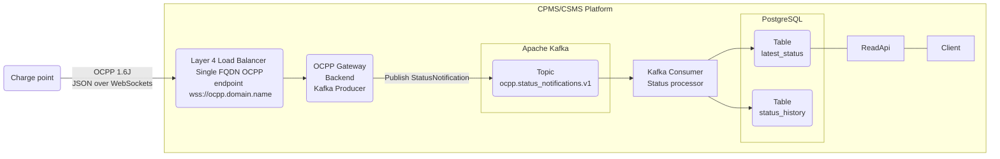

# ocpp-telemetry-platform-poc

## 01 Architecture

This proof of concept implements one telemetry path for `StatusNotification` messages sent over **OCPP version 1.6J - JSON over WebSockets**.

It is assumed that the **OCPP Gateway Backend** already exists and does the following:
1. Authenticates registered charging stations and authorizes their connections.
2. Assigns each charging station an immutable, platform-unique `charger_id` at registration.
3. Publishes `StatusNotification` messages in an envelope containing `charger_id`, a stable `event_id`, a `gateway_received_at` timestamp and the original OCPP payload.
4. Publishes to the `ocpp.status_notifications.v1` Kafka topic using `charger_id` as the record key, with a stable `event_id` when republishing the same message.



The `charger_id` key sends a charger's events to the same Kafka partition which is guaranteed **strict ordering** as received from the producer. However, this does not prevent the producer from sending messages out of order or creating duplicates by resending the same message.

The producer can be configured to be **idempotent** with `enable.idempotence=true` and `acks=all` which guarantees no duplicate writes under retries by using producer IDs and sequence numbers. This naturally has an impact on throughput. Even so, if the producer crashes or restarts for any reason, it gets a new producer ID and the sequence counter resets which might still create duplicates.

At the end of the day we still need our consumer to perform deduplication and out of order processing in order to provide an acurate status history and latest status. The quality of the data available in Kafka is only as good as the producer and the quality of the data delivered is only as good as the consumer.

### Messages sample

Charger to backend StatusNotification OCPP Message:
```
[
  2,
  "123456",
  "StatusNotification",
  {
    "connectorId": 1,
    "errorCode": "NoError",
    "status": "Available",
    "timestamp": "2026-09-25T10:05:00Z"
  }
]
```

Backend to Kafka Message:
```
{
  "event_id": "f64b0e2c-4ad6-4db5-8fe0-d695dd892a74",
  "charger_id": "3cfdb563-65bd-4689-903f-f9430a2b3074",
  "gateway_received_at": "2026-09-25T10:05:00.125Z",
  "action": "StatusNotification",
  "payload": {
    "connectorId": 1,
    "errorCode": "NoError",
    "status": "Available",
    "timestamp": "2026-09-25T10:05:00Z"
  }
}
```

### Kafka consumer

In one transaction the event is inserted into the `status_history` table using the unique `event_id`. If that ID already exists, nothing will happen.
```
INSERT INTO status_history (...)
ON CONFLICT (event_id) DO NOTHING
```

If the event ID does not exist, update the corresponding records in the `latest_status` table but only when the incoming `reported_at` is newer.
> **NOTE**: `reported_at` is the value of `$.payload.timestamp` from the consumed message.

If the charger did not send a timestamp we can compare `gateway_received_at` instead.

A late event therefore remains in history without replacing a newer status. The consumer commits the Kafka offset after the database transaction succeeds, so replay after a crash is safe.

### Database tables sample

The tables below show `charger-07` with two connectors: IDs `1` and `2`. ID `0` is the charger controller itself.

`status_history` keeps every distinct event. The rows below are in Kafka processing order: `evt-105` reached Kafka after `evt-104` even though the gateway received it first.

| event_id | charger_id | connector_id | status | error_code | reported_at | gateway_received_at |
| --- | --- | ---: | --- | --- | --- | --- |
| evt-101 | charger-07 | 0 | Available | NoError | 10:00:00 | 10:00:01 |
| evt-102 | charger-07 | 1 | Available | NoError | 10:01:00 | 10:01:01 |
| evt-103 | charger-07 | 2 | Charging | NoError | 10:02:00 | 10:02:01 |
| evt-104 | charger-07 | 1 | Faulted | InternalError | 10:04:00 | 10:04:01 |
| evt-105 | charger-07 | 1 | Charging | NoError | 10:03:00 | 10:03:01 |

`latest_status` has one row for each `connectorId`. For our `charger-07` with 2 connectors and hence 3 `connectorId`(s) we get 3 rows. The late `evt-105` does not replace connector 1's newer `evt-104`:

| charger_id | connector_id | status | error_code | reported_at | gateway_received_at | event_id |
| --- | ---: | --- | --- | --- | --- | --- |
| charger-07 | 0 | Available | NoError | 10:00:00 | 10:00:01 | evt-101 |
| charger-07 | 1 | Faulted | InternalError | 10:04:00 | 10:04:01 | evt-104 |
| charger-07 | 2 | Charging | NoError | 10:02:00 | 10:02:01 | evt-103 |

If Kafka redelivers `evt-104`, neither table changes because that `event_id` is already in history.

## 02 Platform and developer experience
The goal is to enable others to feed new OCPP event types such as `MeterValues` into Kafka.

This means that our platform needs to handle the following:
1. Producer and consumer authentication and authorization
2. Topic configuration, validation and provisioning
3. Defaults and templates
4. Guardrails and quotas
5. Monitoring

We could define multiple topic tiers/workload classes with different default settings for retention, partitioning, storage tiering, replication, quotas etc. Other workload classes can be implemented upon request. These can be defined by asking question such as:
1. Which environment will produce and consume the data?
2. How long does the data need to be replayable?
3. Is ordering required within a key?

| Workload class | Partitions | Retention | Intended use |
| --- | ---: | ---: | --- |
| `standard` | 6 | 7 days | Low volume event types such as `StatusNotification`. |
| `high_volume` | 12 | 3 days | High volume events such as `MeterValues`. |

### Proposed paved road
Implement a declarative GitOps workflow with desired state files per topic, PRs, templates and CI with Terraform to provision topics, quotas, ACLs and access mapping.

Each topic definition will be declared in a YAML file such as `ocpp-status-notifications-v1.yaml`:
```
topic_name: ocpp.status_notifications.v1
owner: cloud-platform-engineering
workload_class: standard
environment: staging

producers_iam_roles:
  - role_arn: arn:aws:iam::123456789012:role/ocpp-gateway

consumers_iam_roles:
  - role_arn: arn:aws:iam::123456789012:role/status-processor
```

**To request a topic creation** create a new file and fill in the required fields. Open a PR which will trigger a CI workflow which will validate the inputs, run a terraform plan and present the output. If CI passes, the topic owner can freely merge to main which will run terraform apply in the specified environment. Additional checks and approvals could be introduced if the specified environment is production.

**To request modifications to a topic** modify the matching file and open a PR. Permissions change request would go to through the aforementioned CI and the topic owner could aprove the merge to main. Changes to any other fields will require special attention.

To judge whether the platform is any good we could track the time from request submission to usable topic and/or access grant, failed requests, exceptions requiring manual intervention, adoption by other teams and generally gathering feedback.

## 03 Runnable slice

Prerequisites: Docker, Docker Compose, and `make`.

### Start

```bash
make up
```
OR
```bash
docker compose up --build --detach
```

Open the frontend at [http://localhost:8080](http://localhost:8080).

### Stop

```bash
make down
```
OR
```bash
docker compose down --volumes --remove-orphans
```

This will removes the PostgreSQL volume and all locally stored telemetry data.

### API fallback
```bash
# Read all charger and connector statuses
curl http://localhost:8080/api/status/chargers

# Read one charger
curl http://localhost:8080/api/status/chargers/station-001/status

# Start and stop connector 1
curl -X POST http://localhost:8080/api/simulator/chargers/station-001/connectors/1/start
curl -X POST http://localhost:8080/api/simulator/chargers/station-001/connectors/1/stop

# Read recent history for connector 1
curl http://localhost:8080/api/status/chargers/station-001/connectors/1/events

# Demonstrate duplicate handling
curl -X POST \
  'http://localhost:8080/api/simulator/chargers/station-001/connectors/1/demo/duplicate?status=Available'

# Demonstrate out-of-order handling
curl -X POST \
  http://localhost:8080/api/simulator/chargers/station-001/connectors/1/demo/out-of-order
```

## 04 Operations

Run Kafka on a managed **multi-AZ AWS MSK cluster**. **Terraform** can be used to manage all the related cloud resources such as the cluster itsef, networking, IAM + topic, topic ACLs and topic quotas via the Terraform Kafka provider.

IAM can be used for both **authentication and authorization** to the Kafka API.

For a safe deploy we should validate and plan changes in a **staging cluster** first. The same should be done for producers and consumers.

Topic deletion and changes to retention or partition count will require a **review and possible migration plan**.

Topics could be backed up to S3 via MKS Connect.

**Monitoring** via CloudWatch/Datadog with **alerts** for disk space utilisation, I/O performance, CPU usage, consumer lag, partition count and replication config.

## 05 Trade-offs

Risk of overprovisioning in AWS MSK in case of a sudden spike. Storage capacity can't be scaled down. The only resolution is a cluster migration.

AWS cross-AZ traffic cost can be difficult to track.

### What could go wrong when traffic grows 10x
Network throughput, storage throughput, and network throughput between Kafka brokers which could manifest as producer and consumer lag.

There could be instances of "hot" partitions caused by keys that are much more used than others.

### What could be built next
Multi-region AWS MSK Kafka cluster using MKS Replicator if network latency is a concern.

A Kafka topics catalog to keep track and help discover existing topics, their purpose and access.

A more extensive platform with a frontend that also incorporates producers and consumers alongside topics. Something like [Backstage](https://backstage.io/) might work.
